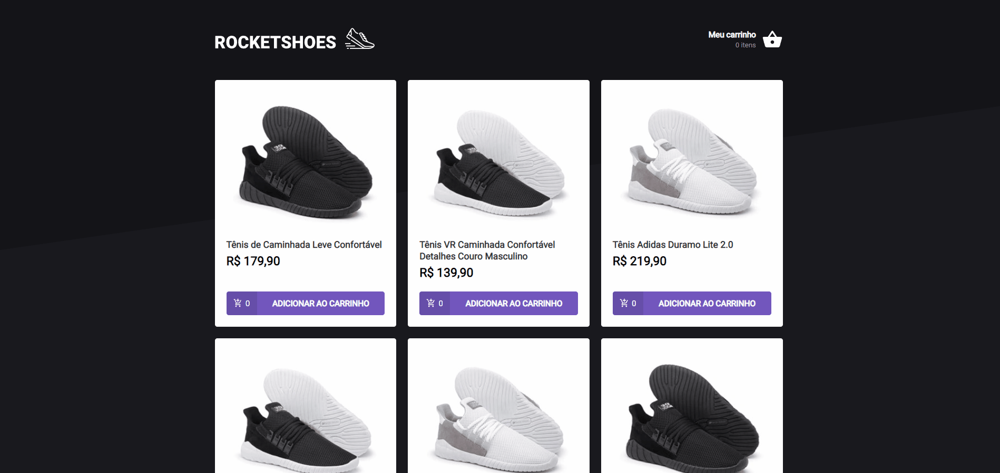

## 🚀 RocketShoes

Principal objetivo do projeto é criar um hook de carrinho de compras. com duas páginas, um componente e um hook para implementar as funcionalidades pedidas nesse desafio:

- Adicionar um novo produto ao carrinho;
- Remover um produto do carrinho;
- Alterar a quantidade de um produto no carrinho;
- Cálculo dos preços sub-total e total do carrinho;
- Validação de estoque;
- Exibição de mensagens de erro;
- Entre outros.

## 🎥 Projeto

<div align="center">
  
</div>

## 🧰 Tecnologias e Bibliotecas

- [ReactJS](https://pt-br.reactjs.org/tutorial/tutorial.html)
  - [styled-components](https://styled-components.com/)
  - [Axios](https://www.npmjs.com/package/axios)
  - [toastify](https://www.npmjs.com/package/react-toastify)
- [TypeScript](https://www.typescriptlang.org/)

### Tools para criar API Fake

- [JSON Server](https://www.npmjs.com/package/json-server)

## ⚙️ Rodando o Projeto

```bash
# Clone este repositório para a pasta anterior
$ git clone https://github.com/diogomfc/RocketShoes.git
# ou use a opção de download.

# Acesse a pasta RocketShoes
$ cd RocketShoes

# Instale as dependências
$ yarn install
ou
$ npm install

# Executando o server
$ yarn server
ou
$ npm server

# Executando o Projeto
$ yarn start
ou
$ npm start

# Acesse http://localhost:3000 no seu navegador
```

<div align="center">
  <small>Diogo Silva - 2021</small>
</div>
